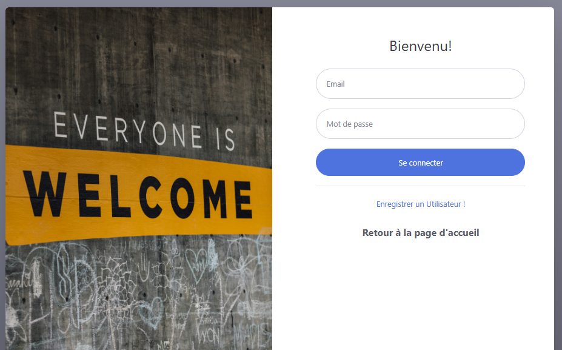
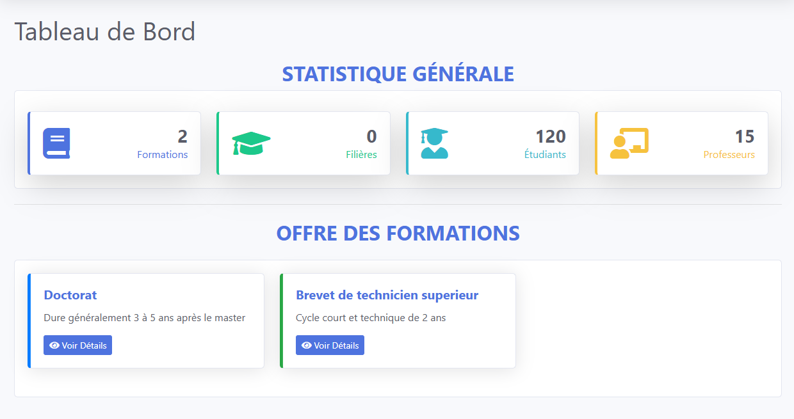
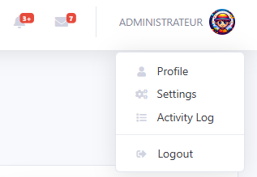
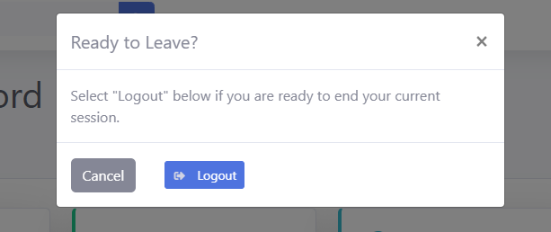

# 📌 Plateforme de gestion des cours et emplois du temps (ISSTMADD)

[](LICENSE)


[](https://github.com/Lulu-hp-dv7/Course-Management/issues)
[](https://github.com/Lulu-hp-dv7/Course-Management/stargazers)

---

## 📑 Table des matières

- [📝 Description](#-description)
- [🚀 Fonctionnalités](#-fonctionnalités)
- [🛠️ Stack technique](#️-stack-technique)
- [⚙️ Prérequis](#️-prérequis)
- [📂 Installation & Utilisation](#-installation--utilisation)
- [📸 Captures d’écran](#-captures-décran)
- [📌 Roadmap](#-roadmap)
- [⚡ Démonstration rapide](#-démonstration-rapide)
- [🤝 Contribution](#-contribution)
- [👨‍💻 Auteur](#-auteur)
- [📜 Licence](#-licence)

## 📝 Description

Ce projet est une application web de gestion des cours et emplois du temps, conçue pour faciliter l’organisation académique des enseignants et étudiants.  
Elle permet d’ajouter, modifier et consulter les cours, avec un suivi automatisé des emplois du temps et un système d’import/export des données.

---

## 🚀 Fonctionnalités

- ✅ CRUD complet des cours  
- ✅ Gestion et affichage dynamique des emplois du temps  
- ✅ Import / Export des données en **Excel**  
- ✅ Interface responsive avec **Bootstrap 5**  
- 🚧 Authentification des utilisateurs (admin/enseignants/étudiants)

---

## 🛠️ Stack technique

| Catégorie         | Technologie |
|-------------------|-------------|
| Framework         | Laravel 11  |
| Frontend Template | [SB Admin 2](https://github.com/startbootstrap/startbootstrap-sb-admin-2) |
| Base de données   | SQLite (Dev) / MySQL (Prod) |
| Frontend Tools    | Bootstrap 5, npm, Git |

---

## ⚙️ Prérequis

- PHP ≥ 8.2  
- Composer  
- Node.js ≥ 18  
- MySQL / SQLite  
- npm  
- Git  

---

## 📂 Installation & Utilisation

### 1. Cloner le repo

````bash
git clone https://github.com/Lulu-hp-dv7/Course-Management.git
````

### 2. Aller dans le dossier du projet

````bash
cd Course-Management
````

### 3. Installer les dépendances

````bash
npm install  
composer install
````

### 4. Configurer l’environnement

Créer un fichier '.env' à la racine du projet et renseigner vos paramètres de base de données. Comme l'exemple ci-apres :

````dotenv
DB_CONNECTION=mysql
DB_HOST=127.0.0.1
DB_PORT=3306
DB_DATABASE=courses
DB_USERNAME=root
DB_PASSWORD=
````

### 5. Lancer le serveur

````bash
npm run dev
php artisan serve
````

Le projet sera disponible sur **[(http://localhost:8000)](http://localhost:8000)**

## 📸 Captures d’écran

### APERÇU DE LA PLATEFORME


### Page de connexion



### Tableau de bord



### Page Deconnexion




## 📌 Roadmap

- ✅ CRUD complet des cours  
- ✅ Gestion dynamique des emplois du temps  
- ✅ Import / Export des données (Excel)  
- 🚧 Authentification (admin / enseignants / étudiants)  
- ⏳ Déploiement sur Docker  
- ❌ Notifications par email  
- 🔜 Optimisation des performances  

## ⚡ Démonstration rapide

````bash
php artisan migrate --seed
php artisan serve
````

## 🤝 Contribution

Les contributions sont les bienvenues !
Merci de forker le repo, créer une branche, proposer vos améliorations et soumettre une pull request..

## 👨‍💻 Auteur

- William D. Tchinda – Développeur Full Stack Junior / Aspirant DevOps  
- [LinkedIn](https://www.linkedin.com/in/loo-a13a66346)  
- [GitHub](https://github.com/Lulu-hp-dv7)  

## 📜 Licence

Ce projet est sous licence MIT – libre d’utilisation et de modification.

````bash
✅ Les badges ajoutés en haut donnent directement des infos :  
- Licence  
- Framework utilisé (Laravel + BootStrap)  
- Base de données  
- Statut du projet  
````
